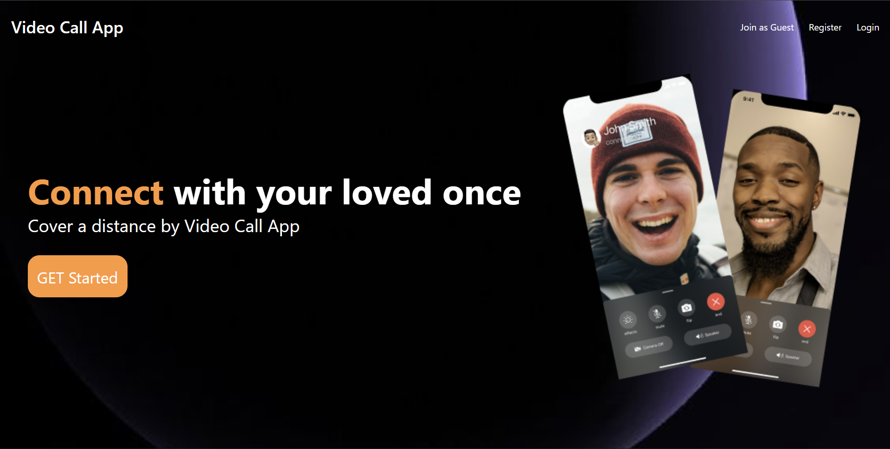
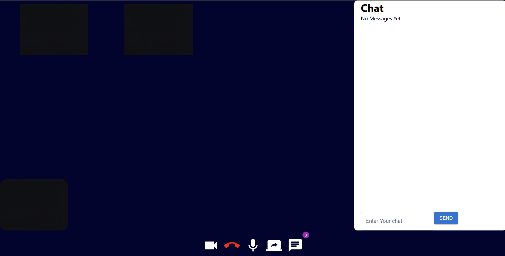
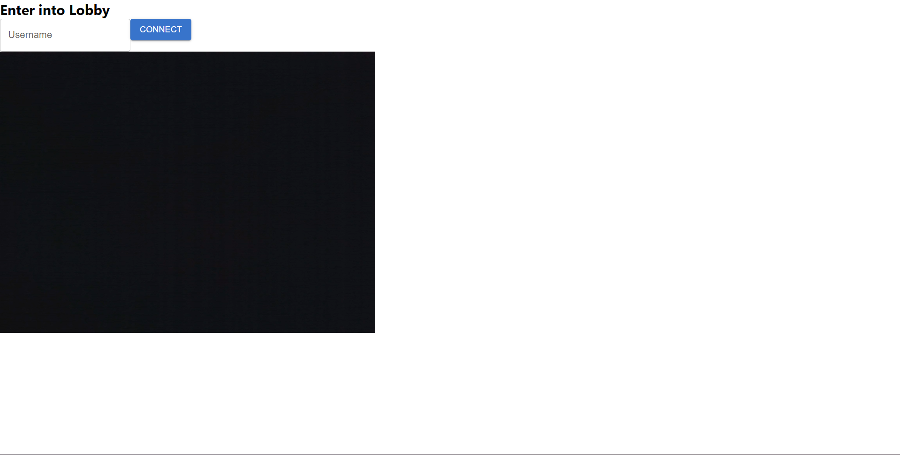
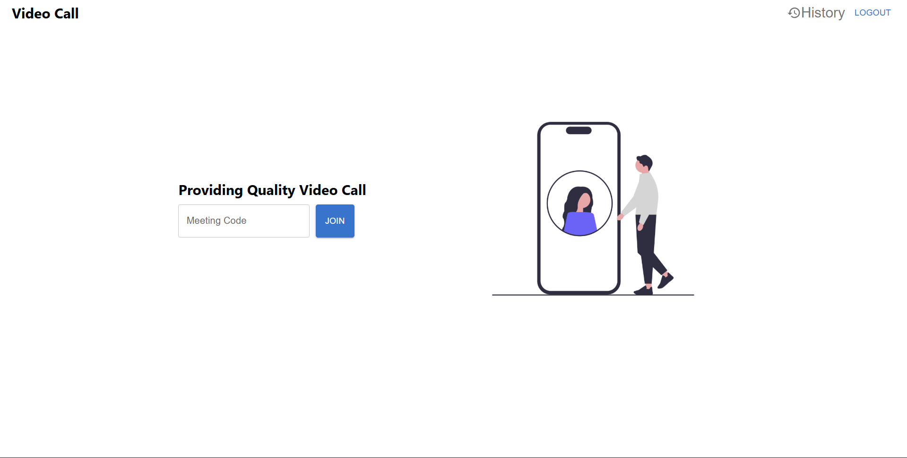
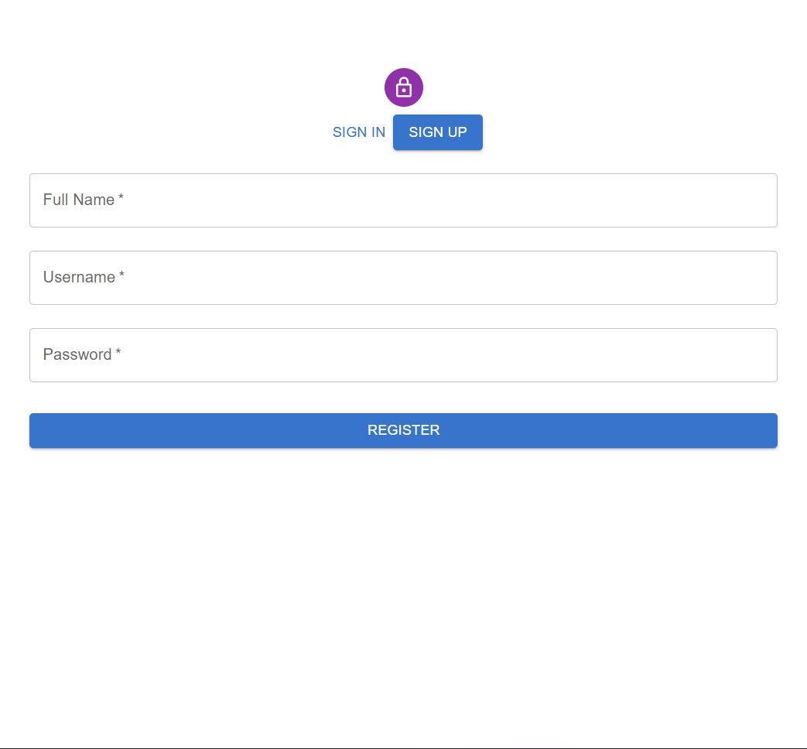
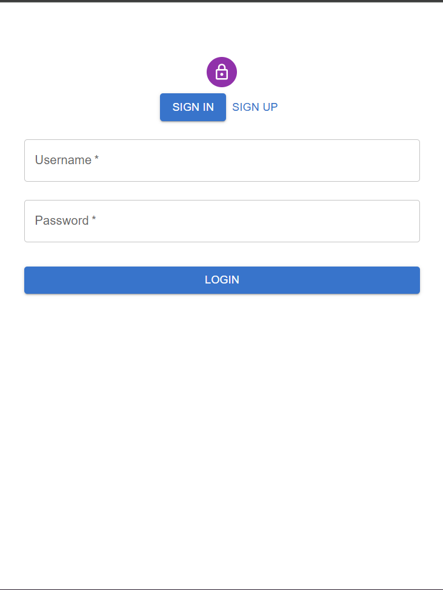

# Zoom Clone (MERN + WebRTC)

A full-stack **Zoom-like video conferencing platform** built with **MERN stack, WebRTC, and Socket.IO**.  
This app supports **real-time video calls, chat messaging, meeting history, and user authentication**.  

Deployed on **Render** with MongoDB Atlas.  

🔗 **Live Demo**: [Frontend Link](https://zoom-frontend-x0jb.onrender.com)  
🔗 **Backend API**: [Backend Link](https://zoom-backend-uau8.onrender.com)  

 ## Demo Credentials

| Username | Password |
|----------|----------|
| demo01   | 12345    |
| demo02   | 12345    |

     
---

## Table of Contents
- [Features](#features)
- [Tech Stack](#tech-stack)
- [Folder Structure](#folder-structure)
- [Getting Started](#getting-started-local-setup)
- [Deployment](#deployment)
- [Screenshots](#screenshots)
- [Future Enhancements](#future-enhancements)
- [Contributing](#contributing)
- [Author](#author)


## Features
- **Real-Time Video Conferencing** – Peer-to-peer video calls powered by WebRTC  
- **Chat Messaging** – Instant chat during calls using Socket.IO  
- **Authentication** – User signup & login 
- **Meeting History** – Track meetings stored in MongoDB   
- **Secure Deployment** – HTTPS on Render  

---

## Tech Stack
- **Frontend**: React, Context API, Custom css(CSS 3) 
- **Backend**: Node.js, Express.js, Socket.IO  
- **Database**: MongoDB Atlas  
- **Real-Time**: WebRTC + Socket.IO  
- **Deployment**: Render (Frontend + Backend)  

---

## Folder Structure

```plaintext
zoom-clone/
│── backend/ # Node.js + Express + Socket.IO API
│ ├── src/
│ │ ├── app.js # Main entry point
│ │ ├── controllers/ # Socket and user controllers
│ │ ├── models/ # MongoDB models
│ │ ├── routes/ # API routes
│ │ └── ...
│ ├── package.json
│ ├── package-lock.json
│ └── .env (ignored)
│
│── frontend/ # React client
│ ├── public/
│ │ ├── index.html
│ │ └── ...
│ ├── src/
│ │ ├── contexts/ # Auth context
│ │ ├── pages/ # Main pages (Home, History, VideoMeet, etc.)
│ │ ├── styles/ # Component styles
│ │ ├── utils/ # Utility functions (withAuth)
│ │ ├── App.js
│ │ ├── index.js
│ │ └── ...
│ ├── package.json
│ └── package-lock.json
│
│── .gitignore
│── README.md # Project overview

```
---

## Getting Started (Local Setup)

### 1. Clone the Repository

  ```bash
    git clone https://github.com/your-username/zoom-clone.git
    cd zoom-clone
  ```
    
### 2. Setup Backend

```bash
  cd backend
  npm install
```

  - Create a .env file in backend/:
      - MONGO_URI=your_mongo_connection_string
      - PORT=8000

  - Run the backend:
    ```bash
     node src/app.js
    ```

### 3. Setup Frontend
```bsh
  cd frontend
  npm install
  npm start
```
  - Frontend will run on http://localhost:3000 by default.

---

##  Deployment

### Backend (Render)
  - Push repo to GitHub

  - Create a Web Service on Render with backend/ as root

  - Add Environment Variables in Render dashboard (MONGO_URI, JWT_SECRET, etc.)

  - Deploy

### Frontend (Render)

  - Deploy the frontend/ folder

  - Update API base URL to point to your deployed backend

---

## Screenshots
- **Landing Page**
  

- **Video Call**
  
  
  

- **Authentication**
  
  

---

## Future Enhancements

  - Record & store meetings

  - Send meeting invites via email

  - Unique meeting links with IDs

---

## Contributing

Pull requests are welcome! For significant changes, please open an issue to discuss first.

--- 

## Author 
  Built by Ritik Thakur
